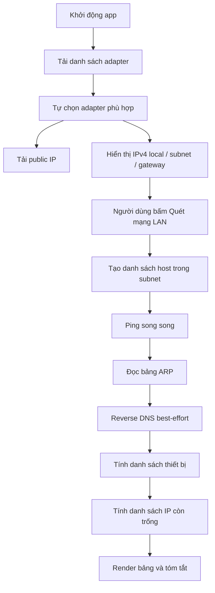

# Network Scanning Desktop App

[](https://www.python.org/)
[](https://pypi.org/project/PyQt5/)
[](https://www.microsoft.com/windows)
[](#license)

Ứng dụng desktop `PyQt5` hỗ trợ lấy `public IP`, xác định adapter IPv4 đang hoạt động, quét mạng LAN bằng `Ping + ARP`, hiển thị danh sách thiết bị trong cùng subnet và liệt kê các IP còn trống.

## Mục lục

- [Giới thiệu](#giới-thiệu)
- [Tính năng](#tính-năng)
- [Công nghệ sử dụng](#công-nghệ-sử-dụng)
- [Cài đặt](#cài-đặt)
- [Cách sử dụng](#cách-sử-dụng)
- [Ví dụ luồng xử lý](#ví-dụ-luồng-xử-lý)
- [Cấu trúc dự án](#cấu-trúc-dự-án)
- [Kiểm thử](#kiểm-thử)
- [Giới hạn hiện tại](#giới-hạn-hiện-tại)
- [License](#license)
- [Liên hệ](#liên-hệ)

## Giới thiệu

### Bài toán

- Cần nhanh chóng biết `public IP` hiện tại của mạng đang dùng.
- Cần xem `IPv4 local`, `subnet`, `gateway` của adapter đang hoạt động trên Windows.
- Cần phát hiện các thiết bị khác đang sử dụng cùng mạng LAN.
- Cần xác định các IP còn trống trong subnet để phục vụ cấu hình thủ công hoặc kiểm tra hạ tầng.

### Giải pháp

- Ứng dụng tự tải danh sách adapter từ Windows bằng PowerShell và tự chọn adapter phù hợp nhất.
- Quét subnet bằng `ping`, sau đó đọc `arp -a` để tăng độ tin cậy khi nhận diện thiết bị.
- Tính danh sách IP còn trống sau khi loại trừ `network`, `broadcast`, `gateway` và IP của máy hiện tại.
- Hiển thị toàn bộ kết quả trong giao diện desktop, gồm bảng thiết bị, bảng IP còn trống và phần tóm tắt phiên quét.

## Tính năng

### Tính năng chính

- Lấy `public IP` hiện tại qua endpoint `ipify`.
- Đọc thông tin adapter IPv4 đang hoạt động trên Windows.
- Cho phép đổi adapter thủ công trong giao diện.
- Quét các host trong cùng subnet bằng `Ping + ARP`.
- Hiển thị danh sách thiết bị phát hiện với `IP`, `MAC`, `hostname`, `nguồn phát hiện`.
- Hiển thị danh sách `IP còn trống` trong subnet hiện tại.
- Theo dõi tiến trình quét bằng `QThreadPool` và cập nhật trạng thái theo thời gian thực.

### Nâng cao trong phiên bản hiện tại

- Tự động ưu tiên adapter có gateway và metric tốt hơn.
- Reverse DNS best-effort để lấy `hostname`.
- Cảnh báo khi subnet lớn, có thể làm thời gian quét kéo dài.
- UI desktop tách riêng khu `Thông tin mạng`, `Tóm tắt phiên quét` và `Kết quả quét`.

### Chưa có trong phiên bản hiện tại

- Chưa hỗ trợ Linux/macOS.
- Chưa hỗ trợ IPv6.
- Chưa có export CSV/Excel.
- Chưa có metadata nâng cao cho public IP như ISP/ASN/location chi tiết.

## Công nghệ sử dụng

- Python `3.10+`
- PyQt5
- `urllib.request` để gọi public IP API
- `subprocess` để chạy PowerShell, `ping`, `arp`
- `ipaddress` để tính subnet và dải host
- `pytest` để kiểm thử

## Cài đặt

### 1. Clone repository

```bash
git clone https://github.com/ntd237/network_scanning_23042026.git
cd network_scanning_23042026
```

### 2. Tạo môi trường ảo

```bash
python -m venv .venv
```

### 3. Kích hoạt môi trường ảo

Windows PowerShell:

```powershell
.venv\Scripts\Activate.ps1
```

Windows Command Prompt:

```bat
.venv\Scripts\activate.bat
```

### 4. Cài dependency

```bash
pip install -r requirements.txt
```

### 5. Kiểm tra cài đặt

```bash
python -m pytest
```

Kết quả mong đợi: toàn bộ test pass.

## Cách sử dụng

### Chạy ứng dụng GUI

```bash
python main.py
```

### Quy trình sử dụng cơ bản

1. Mở ứng dụng.
2. Kiểm tra adapter đang được tự động chọn.
3. Nếu cần, chọn adapter khác trong combobox.
4. Nhấn `Cập nhật public IP` để tải lại IP công khai.
5. Nhấn `Quét mạng LAN` để bắt đầu quét subnet hiện tại.
6. Xem kết quả tại các tab:
   - `Thiết bị phát hiện`
   - `IP còn trống`
   - `Tóm tắt`

## Ví dụ luồng xử lý



### Ví dụ kiểm thử nhanh

```bash
python main.py
python -m pytest
```

## Cấu trúc dự án

```text
network_scanning_23042026/
├─ docs/
│  └─ plan_network_scanning_20260423.md
├─ src/
│  └─ network_scanner/
│     ├─ application/
│     │  ├─ scan_controller.py
│     │  └─ services.py
│     ├─ config/
│     │  ├─ __init__.py
│     │  └─ settings.py
│     ├─ domain/
│     │  ├─ ip_logic.py
│     │  └─ models.py
│     ├─ infrastructure/
│     │  ├─ arp_parser.py
│     │  ├─ dns_resolver.py
│     │  ├─ logging_utils.py
│     │  ├─ ping_runner.py
│     │  ├─ public_ip_client.py
│     │  └─ windows_network.py
│     └─ ui/
│        ├─ main_window.py
│        ├─ table_models.py
│        └─ worker_signals.py
├─ tests/
│  ├─ conftest.py
│  ├─ test_arp_parser.py
│  ├─ test_ip_logic.py
│  └─ test_windows_network_parsing.py
├─ main.py
├─ pytest.ini
├─ README.md
└─ requirements.txt
```

### Mô tả nhanh các phần chính

- `main.py`: entry point ở root, thêm `src/` vào `sys.path` rồi chạy app.
- `src/network_scanner/ui/main_window.py`: giao diện chính của ứng dụng.
- `src/network_scanner/application/scan_controller.py`: điều phối luồng quét.
- `src/network_scanner/infrastructure/windows_network.py`: đọc adapter từ Windows PowerShell.
- `src/network_scanner/infrastructure/public_ip_client.py`: lấy public IP từ `ipify`.
- `src/network_scanner/domain/ip_logic.py`: tính subnet, host hợp lệ và IP còn trống.
- `tests/`: kiểm thử logic subnet, parse adapter và parse ARP.

## Kiểm thử

Chạy toàn bộ test:

```bash
python -m pytest
```

Build kiểm tra syntax:

```bash
python -m compileall main.py src tests
```

## Giới hạn hiện tại

- Chỉ thiết kế cho Windows do phụ thuộc vào PowerShell, `ping` và `arp` của Windows.
- Kết quả phát hiện thiết bị phụ thuộc vào firewall, ICMP response và độ đầy của bảng ARP.
- Public IP hiện tại chỉ lấy IP cơ bản, chưa có thông tin ISP/ASN/location chi tiết.
- `hostname` là best-effort, có thể không lấy được với mọi thiết bị.

## License

Dự án hiện chưa có file `LICENSE`. Nếu bạn muốn public repository theo giấy phép cụ thể, hãy bổ sung file license phù hợp trước khi phát hành rộng rãi.

## Liên hệ

- Tác giả: `ntd237`
- Email: `ntd237.work@gmail.com`
- GitHub: `https://github.com/ntd237`
