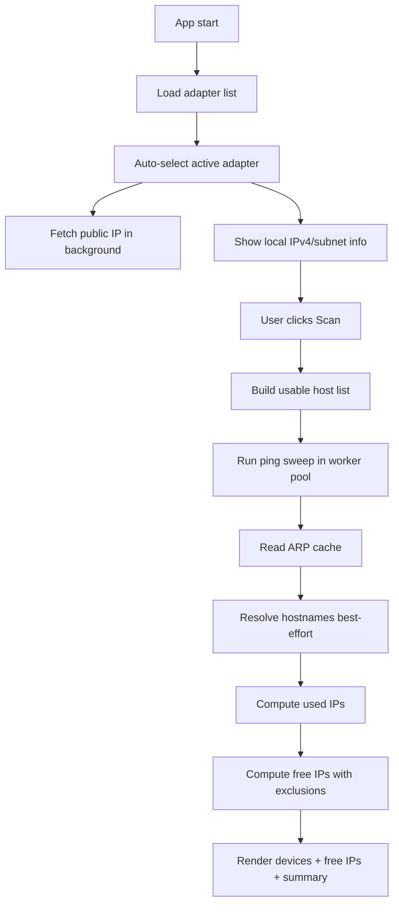
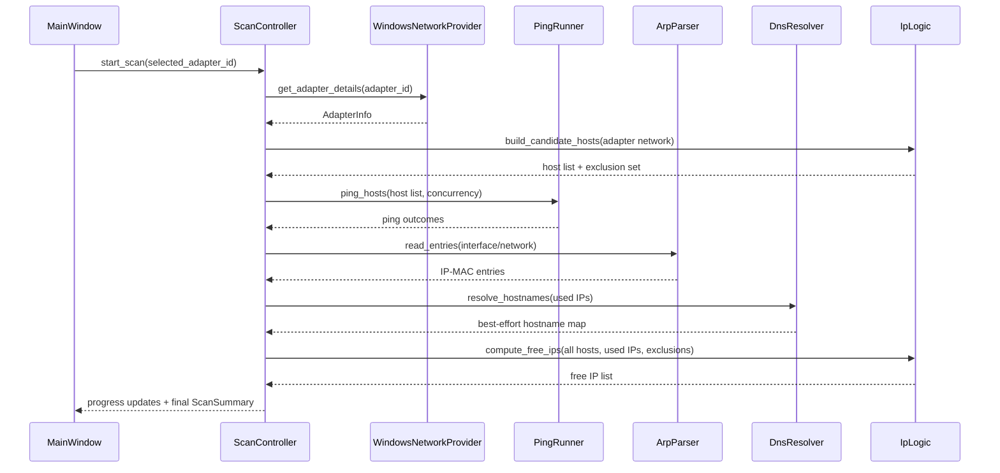

# Network Scanning Desktop App - Implementation Plan

## Phase 0: Input Clarification

### Tóm tắt yêu cầu đã chốt

| Mục | Giá trị đã chốt |
|-----|-----------------|
| Loại dự án | Dự án mới từ đầu |
| Môi trường | Desktop app |
| Nền tảng | Windows-only |
| Ngôn ngữ | Python |
| UI framework | PyQt5 |
| Mục tiêu mạng công khai | Lấy public IP hiện tại của mạng |
| Mục tiêu mạng nội bộ | Xác định IPv4 local hiện tại, subnet, gateway, danh sách thiết bị cùng LAN |
| Phương pháp quét LAN | Ping + ARP |
| Quy tắc IP còn trống | Loại trừ network address, broadcast address, gateway, IP của máy hiện tại |
| Chọn adapter | Tự động chọn adapter đang hoạt động chính, cho phép đổi thủ công trong UI |
| Phiên bản giao thức ưu tiên | IPv4 cho V1 |

### Phạm vi chức năng V1

- Hiển thị adapter đang dùng, IPv4 local, subnet mask, gateway, CIDR của subnet.
- Gọi dịch vụ bên ngoài để lấy public IP hiện tại và metadata best-effort.
- Quét subnet IPv4 của adapter được chọn bằng Ping + ARP.
- Liệt kê host đang hoạt động với tối thiểu các trường: IP, MAC nếu có, hostname nếu resolve được.
- Suy ra danh sách IP còn trống trong subnet theo rule đã chốt.
- Cho phép đổi adapter và quét lại từ UI.
- Giữ UI responsive trong quá trình quét.

### Ngoài phạm vi V1

- Suy luận dải public CIDR của ISP/ASN.
- Port scan, fingerprint service, OS detection.
- Hỗ trợ Linux/macOS.
- Cơ sở dữ liệu lịch sử quét.
- Xuất file Excel/CSV/PDF.
- Quét IPv6.

### Ràng buộc và giả định

- Ứng dụng chạy trên Windows 10/11 có PowerShell và các lệnh mạng chuẩn của Windows.
- Không giả định quyền admin.
- Kết quả phát hiện thiết bị là best-effort do phụ thuộc firewall, ICMP policy và trạng thái ARP cache.
- Mọi tham số vận hành phải đưa vào config, không hardcode trong logic.

---

## Phase 1: Requirements Analysis

### Nghiên cứu codebase

- Workspace hiện tại trống, chưa có source code, config hay cấu trúc dự án sẵn có.
- Không có ràng buộc kế thừa về kiến trúc, naming, dependency hoặc test framework.

### Nghiên cứu kỹ thuật từ nguồn chính thức

| Chủ đề | Phát hiện chính | Nguồn |
|--------|-----------------|-------|
| Tính toán subnet IPv4 | `ipaddress` hỗ trợ `network_address`, `broadcast_address`, `hosts()` và kiểm tra membership; phù hợp để tính host hợp lệ và loại trừ địa chỉ đặc biệt | https://docs.python.org/3/library/ipaddress.html |
| Gọi HTTP từ stdlib | `urllib.request.urlopen()` hỗ trợ timeout; tài liệu cũng lưu ý tác vụ mạng có thể gây block nên không nên chạy trên UI thread | https://docs.python.org/3/library/urllib.request.html |
| Gọi lệnh hệ thống | Python khuyến nghị `subprocess.run()` cho phần lớn trường hợp shell-out đơn giản | https://docs.python.org/3/library/subprocess.html |
| Lấy cấu hình adapter trên Windows | `Get-NetIPConfiguration` trả về cấu hình IP, usable interfaces, IP addresses và gateway; phù hợp để lấy dữ liệu adapter có cấu trúc | https://learn.microsoft.com/en-us/powershell/module/nettcpip/get-netipconfiguration?view=windowsserver2025-ps |
| Xem ARP cache | `arp -a` hiển thị các ARP entries theo interface; phù hợp để map IP sang MAC sau bước ping sweep | https://learn.microsoft.com/en-us/windows-server/administration/windows-commands/arp |
| Xem IPv4/subnet/gateway | `ipconfig` hiển thị IPv4, subnet mask, default gateway cho các adapter; hữu ích làm fallback/diagnostic | https://learn.microsoft.com/en-us/windows-server/administration/windows-commands/ipconfig |
| Public IP API đơn giản | `ipify` hỗ trợ endpoint JSON `https://api.ipify.org?format=json`; phù hợp cho V1 nếu cần public IP tối giản | https://www.ipify.org/ |
| Threading cho UI Qt | `QThreadPool` là primitive phù hợp để chạy background tasks; signal/slot là cơ chế an toàn để chuyển trạng thái về UI | https://doc.qt.io/qt-6/qthreadpool.html , https://doc.qt.io/qt-6/signalsandslots.html , https://doc.qt.io/qt-6/threads-qobject.html |

### User stories

1. Là người vận hành mạng nội bộ, tôi muốn thấy public IP hiện tại của mạng để biết outbound address đang được dùng.
2. Là người dùng desktop, tôi muốn ứng dụng tự chọn adapter chính nhưng vẫn đổi adapter thủ công khi máy có nhiều kết nối.
3. Là người vận hành mạng nội bộ, tôi muốn thấy IPv4 local, subnet mask, gateway và CIDR để hiểu chính xác dải mạng đang dùng.
4. Là người dùng, tôi muốn quét subnet hiện tại để biết thiết bị nào đang online cùng mạng.
5. Là người dùng, tôi muốn xem IP còn trống trong subnet để chọn địa chỉ mới an toàn hơn.
6. Là người dùng desktop, tôi muốn UI không bị treo trong khi quét.

### Yêu cầu chức năng theo EARS

| ID | Yêu cầu |
|----|---------|
| R1 | WHEN ứng dụng khởi động THE SYSTEM SHALL tự động phát hiện danh sách adapter mạng khả dụng trên Windows. |
| R2 | WHEN có nhiều adapter khả dụng THE SYSTEM SHALL tự động chọn adapter đang hoạt động chính theo rule cấu hình và đồng thời cho phép người dùng đổi adapter thủ công. |
| R3 | WHEN một adapter được chọn THE SYSTEM SHALL hiển thị IPv4 local, subnet mask, prefix length, network address, broadcast address và default gateway của adapter đó. |
| R4 | WHEN người dùng yêu cầu làm mới thông tin mạng THE SYSTEM SHALL tải lại danh sách adapter và cập nhật adapter đang chọn nếu adapter cũ không còn hợp lệ. |
| R5 | WHEN ứng dụng cần lấy thông tin public IP THE SYSTEM SHALL gọi endpoint external IP theo cấu hình với timeout cấu hình và hiển thị kết quả hoặc trạng thái lỗi. |
| R6 | WHEN người dùng bắt đầu quét THE SYSTEM SHALL sinh danh sách host IPv4 hợp lệ từ subnet của adapter đang chọn. |
| R7 | WHEN hệ thống sinh danh sách host quét THE SYSTEM SHALL loại trừ network address, broadcast address, default gateway và IPv4 của máy hiện tại khỏi danh sách IP còn trống. |
| R8 | WHEN quét subnet THE SYSTEM SHALL thực hiện ping sweep trên các host mục tiêu bằng mức song song cấu hình. |
| R9 | WHEN ping sweep hoàn tất THE SYSTEM SHALL đọc ARP cache của interface liên quan và ghép các entry để suy ra thiết bị đang hoạt động cùng MAC tương ứng nếu có. |
| R10 | WHEN một IP phản hồi hoặc có ARP entry hợp lệ THE SYSTEM SHALL đưa IP đó vào danh sách thiết bị phát hiện được. |
| R11 | WHEN một IP không được phát hiện là đang dùng THE SYSTEM SHALL đưa IP đó vào danh sách IP còn trống nếu IP này không thuộc tập loại trừ. |
| R12 | WHEN reverse DNS thành công THE SYSTEM SHALL hiển thị hostname cho thiết bị; WHEN reverse DNS thất bại THE SYSTEM SHALL tiếp tục hiển thị thiết bị mà không làm hỏng phiên quét. |
| R13 | WHEN quá trình quét đang chạy THE SYSTEM SHALL cập nhật tiến độ và trạng thái lên UI mà không khóa main thread. |
| R14 | WHEN người dùng đổi adapter trong khi đang quét THE SYSTEM SHALL ngăn việc áp dụng kết quả cũ lên adapter mới và yêu cầu quét lại theo adapter hiện hành. |
| R15 | WHEN một thao tác mạng hoặc lệnh hệ thống thất bại THE SYSTEM SHALL hiển thị lỗi người dùng hiểu được và ghi log chẩn đoán tối thiểu. |
| R16 | WHEN không có adapter IPv4 hợp lệ THE SYSTEM SHALL vô hiệu hóa nút quét và hiển thị hướng dẫn ngắn cho người dùng. |

### Yêu cầu phi chức năng

| ID | Yêu cầu |
|----|---------|
| N1 | Ứng dụng phải giữ UI phản hồi trong suốt quá trình lấy public IP và quét LAN. |
| N2 | Thiết kế ưu tiên thư viện chuẩn Python và API sẵn có của Windows để giữ triển khai đơn giản. |
| N3 | Cấu hình phải tập trung trong module config, không hardcode timeout, concurrency, endpoint hay rule chọn adapter. |
| N4 | Parser phải chịu được output lệnh hệ thống không đầy đủ hoặc thay đổi nhỏ về whitespace. |
| N5 | Có unit tests cho logic subnet/IP filtering và parser thuần dữ liệu; phần network thật dùng manual verification. |

### Giới hạn và rủi ro nghiệp vụ

- Một số thiết bị có thể online nhưng không phản hồi ICMP; chúng chỉ xuất hiện nếu có ARP entry phù hợp.
- ARP cache phụ thuộc vào lưu lượng gần đây; ping sweep nhằm kích hoạt ARP resolution nhưng vẫn không đảm bảo 100%.
- Public IP và metadata phụ thuộc dịch vụ bên ngoài và Internet connectivity.

---

## Phase 2: Specification Generation

### Kiến trúc được đề xuất

Chọn kiến trúc desktop theo lớp đơn giản:

1. `presentation`
   UI PyQt5, widget, model hiển thị, progress/state.
2. `application`
   Orchestrator use case: load adapters, refresh public IP, run scan, cancel/ignore stale jobs.
3. `infrastructure`
   Adapter provider Windows, public IP client, ping runner, ARP reader, DNS resolver, logger.
4. `domain`
   Value objects và logic thuần: adapter info, scan result, device record, IP range calculator, exclusion rules.

### Cấu trúc thư mục đề xuất

```text
network_scanning_23042026/
├─ docs/
│  └─ plan_network_scanning_20260423.md
├─ main.py
├─ src/
│  └─ network_scanner/
│     ├─ __init__.py
│     ├─ config/
│     │  ├─ __init__.py
│     │  └─ settings.py
│     ├─ domain/
│     │  ├─ __init__.py
│     │  ├─ models.py
│     │  └─ ip_logic.py
│     ├─ application/
│     │  ├─ __init__.py
│     │  ├─ services.py
│     │  └─ scan_controller.py
│     ├─ infrastructure/
│     │  ├─ __init__.py
│     │  ├─ windows_network.py
│     │  ├─ public_ip_client.py
│     │  ├─ ping_runner.py
│     │  ├─ arp_parser.py
│     │  ├─ dns_resolver.py
│     │  └─ logging_utils.py
│     └─ ui/
│        ├─ __init__.py
│        ├─ main_window.py
│        ├─ worker_signals.py
│        └─ table_models.py
├─ tests/
│  ├─ test_ip_logic.py
│  ├─ test_arp_parser.py
│  └─ test_windows_network_parsing.py
├─ requirements.txt
└─ pytest.ini
```

### Trách nhiệm từng module

| Module | Trách nhiệm |
|--------|-------------|
| `config/settings.py` | Khai báo toàn bộ hằng số vận hành: endpoint public IP, timeout, concurrency, rule chọn adapter, số lần retry nhẹ, command template |
| `domain/models.py` | Dataclass cho `AdapterInfo`, `PublicIpInfo`, `DeviceInfo`, `ScanSummary` |
| `domain/ip_logic.py` | Tính network/broadcast/usable hosts, exclusion set, free IPs |
| `infrastructure/windows_network.py` | Gọi PowerShell `Get-NetIPConfiguration`, parse JSON/structured text, map thành `AdapterInfo` |
| `infrastructure/public_ip_client.py` | Gọi external IP endpoint, parse JSON và normalize lỗi |
| `infrastructure/ping_runner.py` | Ping sweep song song bằng `subprocess.run()` |
| `infrastructure/arp_parser.py` | Đọc `arp -a`, parse theo interface/IP-MAC |
| `infrastructure/dns_resolver.py` | Resolve hostname best-effort |
| `application/services.py` | Kết nối các dependency hạ tầng với domain logic |
| `application/scan_controller.py` | Điều phối scan lifecycle, progress, stale job guard |
| `main.py` | Entry point ở thư mục gốc, bootstrap QApplication và gọi UI chính |
| `ui/main_window.py` | Main window, adapter dropdown, info panel, scan button, progress bar, tables |
| `ui/worker_signals.py` | QObject signals cho worker background |
| `ui/table_models.py` | Model hiển thị danh sách thiết bị và IP trống |

### Lựa chọn kỹ thuật

| Quyết định | Lựa chọn |
|-----------|----------|
| UI | PyQt5 |
| Threading UI | `QThreadPool` + `QRunnable` + Qt signals |
| Tính subnet | `ipaddress` của Python stdlib |
| Gọi public IP API | `urllib.request` để tránh thêm dependency HTTP cho V1 |
| Đọc adapter Windows | PowerShell `Get-NetIPConfiguration` |
| Ping sweep | `subprocess.run()` gọi `ping` của Windows |
| MAC discovery | `arp -a` sau ping sweep |
| Hostname | `socket.gethostbyaddr()` best-effort |
| Logging | `logging` stdlib |
| Test framework | `pytest` |

### Trade-off Analysis

| Approach | Pros | Cons | Complexity | Security | Recommendation |
|----------|------|------|------------|----------|----------------|
| A. Python stdlib + PowerShell/Windows CLI hybrid | Ít dependency, tận dụng API Windows sẵn có, đơn giản cho V1, dễ đóng gói | Cần parse output/JSON từ lệnh hệ thống, phụ thuộc Windows command availability | Low | Medium | ✅ Chọn |
| B. `psutil` + Python stdlib + ping/arp | Mã Python thuần hơn, đỡ phụ thuộc PowerShell | Thêm dependency, gateway/adapter semantics vẫn cần xử lý riêng, vẫn phải parse `arp` | Medium | Medium | ❌ Không chọn |
| C. `scapy` hoặc tích hợp Nmap | Khả năng discovery mạnh hơn, có thể mở rộng fingerprint | Quá nặng cho V1, có thể cần quyền cao hơn, packaging phức tạp, vượt YAGNI | High | Medium | ❌ Không chọn |

### Phương án được chọn

Chọn **Approach A: Python stdlib + PowerShell/Windows CLI hybrid**.

Lý do:

- Phù hợp nhất với ràng buộc `Windows-only`.
- Tối thiểu hóa dependency ngoài `PyQt5` và `pytest`.
- `Get-NetIPConfiguration` cho dữ liệu adapter có cấu trúc tốt hơn so với parse `ipconfig` thuần text.
- `ping` và `arp -a` là đường đi đơn giản nhất để hiện thực `Ping + ARP` đúng scope.
- Giữ đúng KISS/YAGNI: không thêm scanner library chuyên dụng khi V1 chưa cần port scan hay raw packet crafting.

### Luồng xử lý chính



### Sequence cho một phiên quét



### Spec UI/UX cho V1

#### Bố cục cửa sổ chính

1. Thanh trên cùng
   - `ComboBox` chọn adapter
   - `Refresh adapters`
   - `Refresh public IP`
   - `Scan`
2. Thẻ thông tin mạng hiện tại
   - Adapter name
   - IPv4 local
   - Subnet mask
   - CIDR
   - Gateway
   - Public IP
   - Public IP status/message
3. Khu vực tiến trình
   - Progress bar
   - Trạng thái scan hiện tại
   - Tổng số host cần quét, số host đã xử lý
4. Tab kết quả
   - Tab `Thiết bị phát hiện`: bảng `IP`, `MAC`, `Hostname`, `Nguồn phát hiện`
   - Tab `IP còn trống`: bảng `IP`
   - Tab `Tóm tắt`: tổng host hợp lệ, host phát hiện, host trống, IP bị loại trừ

#### Rule trạng thái UI

- Trong lúc quét:
  - Disable `Scan`
  - Disable đổi adapter hoặc cho đổi nhưng phải hủy/khoá session cũ theo guard
  - Cho phép xem tiến trình tăng dần
- Khi quét xong:
  - Enable lại toàn bộ thao tác
  - Hiển thị timestamp lần quét gần nhất
- Khi lỗi:
  - Giữ app chạy, hiển thị banner/status message thay vì crash dialog khó hiểu

### Quản lý cấu hình

Tất cả tham số sau phải nằm trong `config/settings.py`:

| Key | Mục đích |
|-----|----------|
| `PUBLIC_IP_URL` | Endpoint lấy public IP |
| `PUBLIC_IP_TIMEOUT_SECONDS` | Timeout cho external IP lookup |
| `NETWORK_COMMAND_TIMEOUT_SECONDS` | Timeout chung cho command mạng |
| `PING_COUNT` | Số gói ping mỗi host |
| `PING_TIMEOUT_MS` | Timeout ping mỗi host |
| `SCAN_MAX_WORKERS` | Số worker đồng thời |
| `AUTO_SELECT_STRATEGY` | Rule chọn adapter chính |
| `ARP_COMMAND` | Template lệnh ARP |
| `POWERSHELL_COMMAND` | Template lệnh PowerShell |
| `DNS_LOOKUP_TIMEOUT_SECONDS` | Timeout reverse DNS best-effort |
| `MAX_HOSTS_WARNING_THRESHOLD` | Ngưỡng cảnh báo subnet lớn |

### Edge Cases

| Edge Case | Trigger Condition | Expected Behavior | Impact if Ignored | Trace |
|-----------|-------------------|-------------------|-------------------|-------|
| Không có adapter IPv4 hợp lệ | Máy chỉ còn loopback/VPN không usable | Disable scan, báo người dùng | App scan sai hoặc crash | R1, R16 |
| Có nhiều adapter active | Wi-Fi và Ethernet cùng bật | Auto-select theo rule cấu hình, vẫn cho đổi tay | Chọn sai subnet | R2 |
| Adapter đổi trạng thái giữa phiên quét | Rút cáp/tắt Wi-Fi giữa lúc quét | Phiên quét fail gracefully, báo cần quét lại | Kết quả sai, UI treo | R4, R14, R15 |
| Public IP API timeout | Mất Internet hoặc endpoint chậm | Hiển thị lỗi riêng cho public IP, không chặn phần LAN scan | Người dùng hiểu sai là app hỏng hoàn toàn | R5, R15 |
| Public IP API trả dữ liệu lạ | JSON thiếu field mong đợi | Fallback hiển thị raw IP nếu có, ngược lại báo lỗi parse | Crash hoặc dữ liệu rác | R5, R15 |
| Subnet rất lớn | `/16` hoặc lớn hơn | Cảnh báo thời gian quét dài, có thể yêu cầu xác nhận hoặc giới hạn V1 | UI đơ, trải nghiệm kém | R6, N1 |
| Firewall chặn ICMP | Ping không phản hồi | Vẫn đọc ARP và ghi chú kết quả best-effort | Thiết bị online bị bỏ sót mà không giải thích | R9, R10, R15 |
| ARP cache rỗng | Chưa có ARP resolution đủ nhiều | Bảng thiết bị có thể thiếu MAC, hiển thị chú thích | Người dùng tin sai độ chính xác | R9, R15 |
| Reverse DNS lỗi | Thiết bị không có PTR record | Giữ hostname trống, không fail scan | Kết quả mất toàn bộ do một host lỗi | R12 |
| Gateway trùng danh sách used IPs | Gateway phản hồi như host bình thường | Không đưa gateway vào danh sách IP trống; có thể vẫn hiển thị trong danh sách thiết bị | Tính sai free IP | R7, R10, R11 |
| Output lệnh có locale khác | Windows tiếng Việt/tiếng Anh khác nhau | Ưu tiên PowerShell JSON/structured fields; parser text phải tolerant | Parse fail trên máy người dùng | R1, R3, N4 |
| Người dùng bấm Scan liên tiếp | Tạo nhiều scan job chồng nhau | Chặn scan mới hoặc hủy/ignore scan cũ | Race condition, kết quả lẫn | R13, R14 |

### Exception Handling Strategy

| Exception Type | Source | Handling Strategy | User Impact | Recovery Action |
|----------------|--------|-------------------|-------------|-----------------|
| `URLError` / timeout | `urllib.request` khi gọi public IP API | Catch, map thành status `Public IP unavailable`, log warning | Không có public IP trong phiên hiện tại | Cho phép người dùng bấm refresh lại |
| `JSONDecodeError` | Parse response public IP | Bắt lỗi parse, hiển thị thông báo endpoint không hợp lệ | Không có metadata công khai | Retry thủ công, có thể đổi endpoint qua config |
| `CalledProcessError` hoặc non-zero return code | `subprocess.run()` cho ping/PowerShell/arp | Chuẩn hoá lỗi theo command type, không làm crash app | Một phần dữ liệu thiếu | Bỏ qua phần hỏng và cho phép retry |
| `TimeoutExpired` | `subprocess.run()` quá lâu | Dừng command đó, đánh dấu host/lệnh thất bại | Quét thiếu dữ liệu | Tiếp tục quét phần còn lại, cho phép retry |
| `ValueError` | Parse IP/subnet từ output hệ thống | Bỏ adapter/lần parse không hợp lệ, log chi tiết | Một adapter không hiển thị hoặc hiển thị lỗi | Refresh adapters |
| `socket.herror` / `socket.gaierror` | Reverse DNS | Ignore per-host, hostname để trống | Chỉ thiếu hostname | Không cần retry toàn cục |
| `OSError` | Lỗi môi trường hệ thống khi gọi executable | Hiển thị command unavailable | Một chức năng không hoạt động | Chỉ dẫn người dùng kiểm tra Windows environment |
| `RuntimeError` ứng dụng | Stale job / scan controller invariant | Nuốt lỗi có kiểm soát, bỏ kết quả cũ | Có thể mất kết quả quét cũ | Người dùng quét lại |

### Race Conditions & Concurrency

| Shared Resource | Concurrent Access Scenario | Risk | Mitigation Strategy |
|-----------------|---------------------------|------|---------------------|
| Trạng thái scan hiện tại | Người dùng bấm `Scan` nhiều lần | Kết quả phiên sau/phiên trước ghi đè lẫn nhau | Dùng `scan_session_id`; chỉ UI áp dụng kết quả nếu session còn current |
| Adapter đang chọn | Người dùng đổi adapter khi worker cũ chưa xong | Kết quả quét sai adapter | Khóa đổi adapter khi quét hoặc invalidate session cũ ngay khi adapter đổi |
| UI widgets | Worker thread cập nhật trực tiếp widget | Crash/undefined behavior | Chỉ cập nhật UI qua Qt signals/slots trên main thread |
| Progress counter | Nhiều worker ping hoàn thành cùng lúc | Progress nhảy sai, race số đếm | Tổng hợp qua signal serialized về controller/UI |
| ARP read timing | Đọc ARP quá sớm trước khi ping hoàn tất | Thiếu MAC/host | Chỉ đọc ARP sau khi ping sweep kết thúc hoặc sau barrier rõ ràng |
| Log file / logger | Nhiều worker ghi log cùng lúc | Interleaved logs | Dùng `logging` thread-safe, format có session id |

### Yêu cầu idempotency

- `Refresh adapters` và `Refresh public IP` là thao tác đọc, có thể lặp lại an toàn.
- `Scan` phải được coi là idempotent theo từng session: chỉ kết quả của session mới nhất được phép hiển thị.

---

## Phase 3: Implementation Planning

### Phân loại yêu cầu

- Category: `New Project`
- Workflow áp dụng: `New project workflow (5 phases)`
- Mức độ: `Complex`
  - Có UI desktop
  - Có nhiều module độc lập
  - Có I/O mạng, command execution, concurrency và parsing

### Kế hoạch triển khai 5 phase

#### Phase 1: Information Gathering and Planning

**Task: Khởi tạo skeleton dự án Python**
Goal: Tạo cấu trúc thư mục tối thiểu để các module và test có chỗ đặt rõ ràng.
Files: `main.py`, `src/network_scanner/*`, `tests/*`, `requirements.txt`, `pytest.ini`
Minimal change: Tạo package structure, file rỗng và dependency cơ bản.
Verify command: `python -m pytest`
Expected output: Test discovery chạy được dù chưa có test hoặc có test placeholder pass.
Rollback note: Xóa cấu trúc vừa tạo nếu cần reset scaffold.

**Task: Tạo module config tập trung**
Goal: Đảm bảo toàn bộ tham số vận hành được quản lý trong một nơi duy nhất.
Files: `src/network_scanner/config/settings.py`
Minimal change: Khai báo constants/config dataclass cho endpoint, timeout, concurrency.
Verify command: `python -c "from network_scanner.config.settings import *; print('ok')"`
Expected output: In `ok` không lỗi import.
Rollback note: Khôi phục file config về trạng thái trước đó.

#### Phase 2: Project Architecture

**Task: Tạo domain models và IP logic**
Goal: Chuẩn hóa model dữ liệu và logic subnet/free-IP thuần Python.
Files: `src/network_scanner/domain/models.py`, `src/network_scanner/domain/ip_logic.py`
Minimal change: Tạo dataclass và hàm thuần cho subnet math.
Verify command: `python -m pytest tests/test_ip_logic.py`
Expected output: Test logic subnet pass.
Rollback note: Revert module domain và test liên quan.

**Task: Thiết kế contract cho infrastructure services**
Goal: Xác định interface tối thiểu cho adapter provider, public IP client, ping runner, ARP parser, DNS resolver.
Files: `src/network_scanner/application/services.py`, `src/network_scanner/domain/models.py`
Minimal change: Định nghĩa service contracts đủ để UI không phụ thuộc chi tiết implementation.
Verify command: `python -c "from network_scanner.application.services import *; print('ok')"`
Expected output: Import thành công.
Rollback note: Quay về contract đơn giản hơn nếu abstraction bị dư thừa.

#### Phase 3: Core Implementation

**Task: Implement adapter discovery cho Windows**
Goal: Lấy danh sách adapter usable và chi tiết IPv4/subnet/gateway bằng PowerShell.
Files: `src/network_scanner/infrastructure/windows_network.py`, `tests/test_windows_network_parsing.py`
Minimal change: Gọi `Get-NetIPConfiguration`, parse dữ liệu thành `AdapterInfo`.
Verify command: `python -m pytest tests/test_windows_network_parsing.py`
Expected output: Parser test pass với sample output/mock data.
Rollback note: Chuyển tạm sang fallback `ipconfig` parser nếu PowerShell parse chưa ổn.

**Task: Implement public IP client**
Goal: Lấy public IP và status/message tương ứng từ endpoint cấu hình.
Files: `src/network_scanner/infrastructure/public_ip_client.py`
Minimal change: `urllib.request` + timeout + parse JSON tối giản.
Verify command: `python -m pytest`
Expected output: Test hoặc smoke import pass; runtime trả dữ liệu hoặc status lỗi chuẩn hóa.
Rollback note: Tắt metadata phụ, chỉ giữ IP string nếu endpoint parse phức tạp.

**Task: Implement ping runner**
Goal: Ping hàng loạt host với concurrency cấu hình mà không khóa UI.
Files: `src/network_scanner/infrastructure/ping_runner.py`
Minimal change: Wrapper `subprocess.run` cho `ping` và helper batch execution.
Verify command: `python -m pytest`
Expected output: Unit tests/mock tests pass cho builder/parsing; manual smoke không crash.
Rollback note: Giảm concurrency hoặc đổi chiến lược batching nếu timeout cao.

**Task: Implement ARP parser và DNS resolver**
Goal: Ghép IP-MAC và resolve hostname best-effort.
Files: `src/network_scanner/infrastructure/arp_parser.py`, `src/network_scanner/infrastructure/dns_resolver.py`, `tests/test_arp_parser.py`
Minimal change: Parse `arp -a`, map IP->MAC, resolve hostname với error tolerance.
Verify command: `python -m pytest tests/test_arp_parser.py`
Expected output: Parser hoạt động với mẫu output chuẩn.
Rollback note: Nếu DNS gây chậm, cho phép disable hostname lookup bằng config.

**Task: Implement scan controller**
Goal: Điều phối session scan, progress, stale-result guard và kết quả cuối.
Files: `src/network_scanner/application/scan_controller.py`, `src/network_scanner/application/services.py`
Minimal change: Kết nối adapter info, ping, arp, dns, ip_logic thành use case hoàn chỉnh.
Verify command: `python -m pytest`
Expected output: Test orchestration pass với fake services.
Rollback note: Tách nhỏ controller nếu trách nhiệm bị phình to.

#### Phase 4: Integration and Optimization

**Task: Implement main window và worker signals**
Goal: Tạo UI chạy được với adapter combo, info panel, progress và bảng kết quả.
Files: `main.py`, `src/network_scanner/ui/main_window.py`, `src/network_scanner/ui/worker_signals.py`, `src/network_scanner/ui/table_models.py`
Minimal change: UI functional trước, styling tối giản sau.
Verify command: `python main.py`
Expected output: Cửa sổ mở được, load adapter, nút scan phản hồi.
Rollback note: Simplify layout nếu binding trạng thái quá phức tạp.

**Task: Tối ưu responsiveness và guard concurrency**
Goal: Đảm bảo UI không block và không chấp nhận kết quả scan cũ.
Files: `src/network_scanner/ui/main_window.py`, `src/network_scanner/application/scan_controller.py`
Minimal change: QThreadPool/QRunnable + signal updates + session id guard.
Verify command: Manual: mở app, bấm scan, thử đổi adapter/quét lại
Expected output: Không treo UI, không lẫn kết quả giữa các phiên.
Rollback note: Giảm song song hoặc khóa thao tác đổi adapter khi scan.

#### Phase 5: Documentation and Deployment

**Task: Bổ sung test và smoke validation**
Goal: Có bộ test tối thiểu cho logic cốt lõi và checklist manual verification.
Files: `tests/test_ip_logic.py`, `tests/test_arp_parser.py`, `tests/test_windows_network_parsing.py`
Minimal change: Test logic thuần + mock parser + manual checklist trong comment/code docs ngắn nếu cần.
Verify command: `python -m pytest`
Expected output: Test pass.
Rollback note: Giữ lại test logic bắt buộc, tạm bỏ test integration quá giòn.

**Task: Hoàn thiện dependency list và cách chạy**
Goal: Cho dự án có thể cài và chạy nhất quán trong môi trường Windows.
Files: `requirements.txt`
Minimal change: Chỉ liệt kê dependency thật sự cần.
Verify command: `pip install -r requirements.txt`
Expected output: Cài thành công không conflict lớn.
Rollback note: Loại dependency dư thừa hoặc khóa version mềm hơn.

### Parallel opportunities

Các tác vụ có thể chạy song song ở giai đoạn triển khai thực tế:

- `public_ip_client` song song với `windows_network` vì độc lập.
- `arp_parser` song song với `dns_resolver` sau khi contract domain đã ổn.
- `ui/table_models.py` song song với `scan_controller.py` khi data contracts đã khóa.

Các tác vụ không được song song:

- Không implement UI binding cuối cùng trước khi contract `ScanSummary` ổn định.
- Không tính free IP trước khi rule exclusion trong `ip_logic` đã hoàn tất.

### Traceability matrix

| Task | Requirements chính |
|------|--------------------|
| Skeleton + config | N2, N3 |
| Domain models + IP logic | R3, R6, R7, R11, N5 |
| Windows adapter discovery | R1, R2, R3, R4, R16 |
| Public IP client | R5, R15 |
| Ping runner | R8, R13, N1 |
| ARP parser | R9, R10 |
| DNS resolver | R12 |
| Scan controller | R6-R15, N1 |
| Main window | R2, R3, R4, R13, R15, R16 |
| Tests and validation | N4, N5 |

### Quality gates

| Gate | Điều kiện đạt |
|------|---------------|
| G1 | App mở được và load adapter không crash trên Windows |
| G2 | Public IP refresh không khóa UI và có timeout rõ ràng |
| G3 | Scan `/24` hoàn tất với progress và trả về danh sách thiết bị/IP trống hợp lệ |
| G4 | Gateway, network, broadcast, local IP không xuất hiện trong bảng IP trống |
| G5 | Bấm scan liên tiếp không làm lẫn kết quả giữa các phiên |
| G6 | `pytest` pass cho test logic và parser |

### Manual verification plan

1. Chạy app trên Windows có một adapter IPv4 hoạt động.
2. Xác nhận adapter chính được chọn tự động đúng.
3. Đổi adapter thủ công nếu máy có nhiều adapter.
4. Bấm `Refresh public IP` khi có Internet và khi ngắt Internet.
5. Bấm `Scan` trên subnet nhỏ như `/24`.
6. So sánh gateway/local IP với rule loại trừ trong bảng IP trống.
7. Bấm `Scan` liên tiếp để kiểm tra stale session guard.
8. Tắt/bật Wi-Fi giữa lúc quét để kiểm tra fail gracefully.

### Simplicity constraints

- Không thêm thư viện scan mạng chuyên sâu cho V1.
- Không thêm persistence/database.
- Không thêm export/reporting.
- Không thêm plugin architecture.
- Không thêm abstraction layer nếu mới chỉ có một implementation thực tế.

### Kết luận plan

Plan này đủ để bắt đầu triển khai một desktop app PyQt5 cho Windows theo đúng scope V1, với trọng tâm là:

- Đơn giản hóa dependency.
- Giữ UI responsive.
- Tách logic thuần khỏi command/network I/O.
- Xử lý rõ giới hạn của mô hình `Ping + ARP`.
